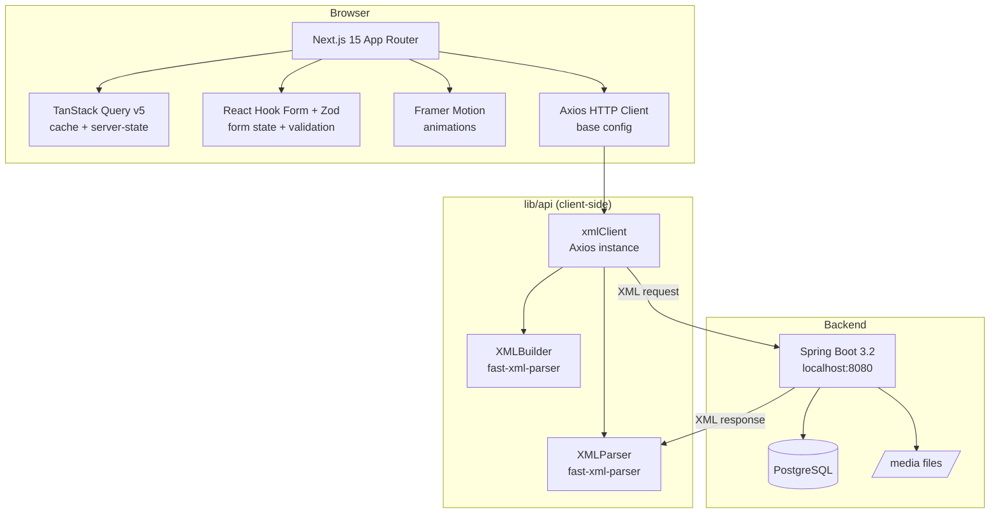
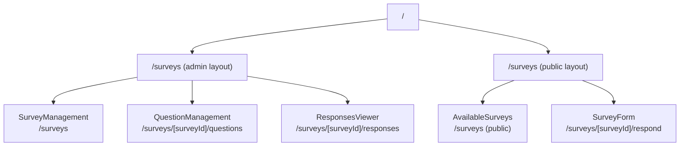
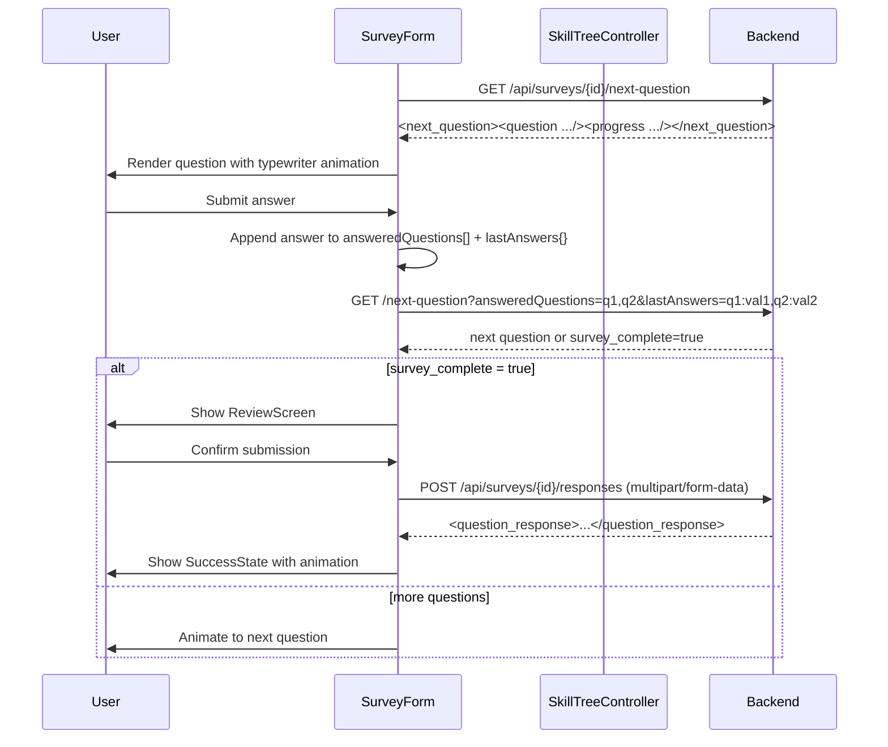
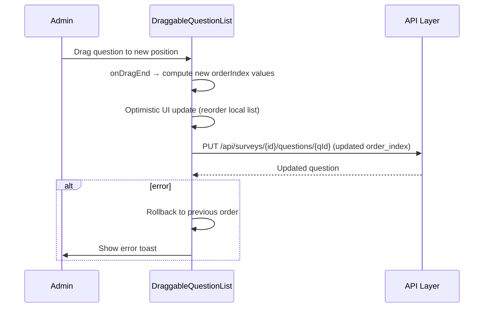
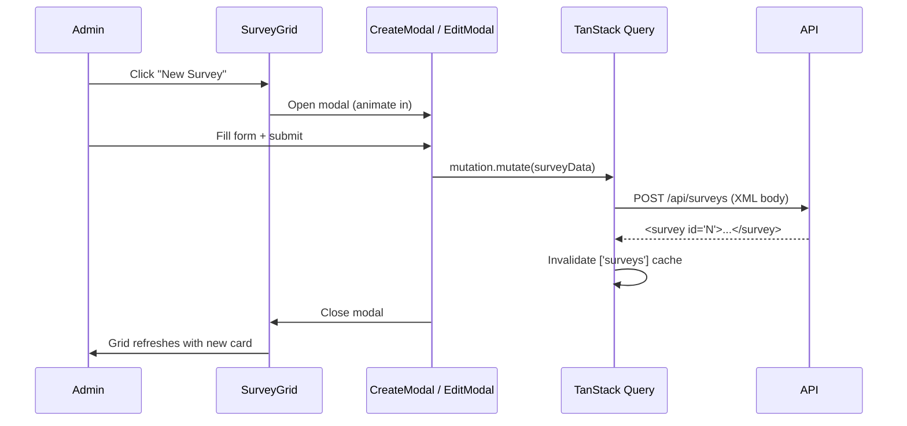
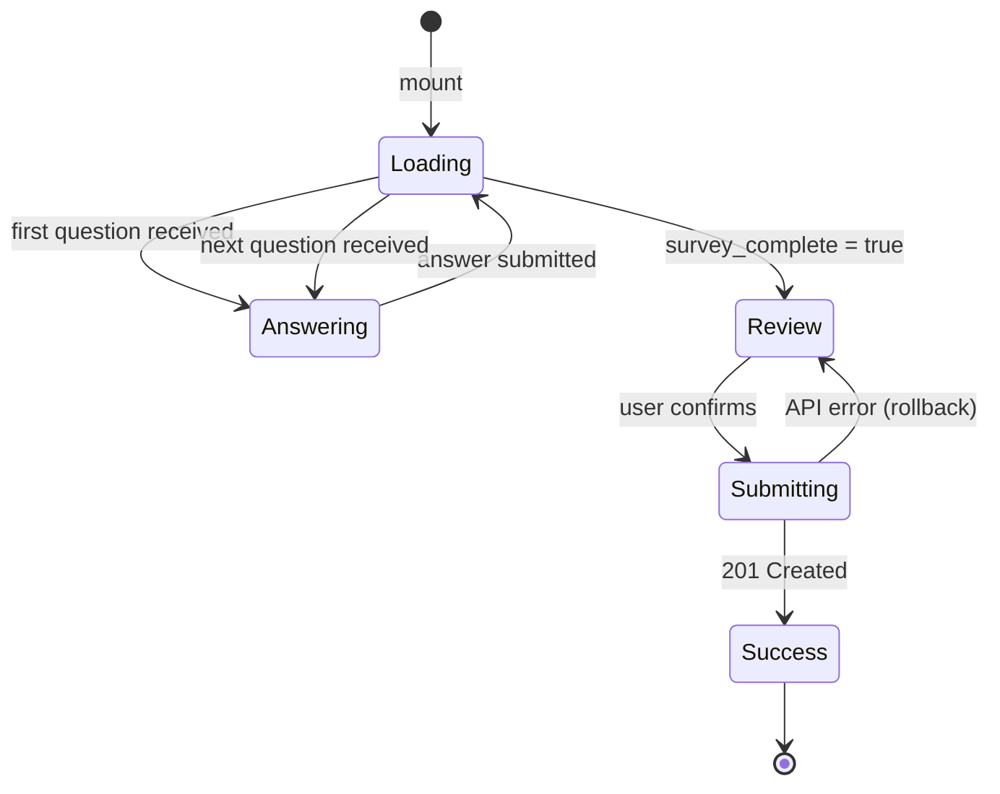

# Design Document: simple-survey-web

## Overview

`simple-survey-web` is the full frontend for the **SkyWorld Survey Platform** — a Next.js 15 (App Router) application styled with the "Deep Sea Logic" design system. It communicates exclusively with a Spring Boot 3.2 REST backend at `http://localhost:8080` that speaks XML, parsing all responses with `fast-xml-parser` and serialising all request bodies via `XMLBuilder`. The application has two faces: an **Admin interface** (survey/question management, responses review) and a **Public interface** (available surveys listing, stepped form with branching logic, file upload, success state).

The five pages cover the complete survey lifecycle — create, configure, publish, respond, and review — using a unified visual language of near-black backgrounds, teal/emerald primaries, Instrument Serif headings, DM Sans body copy, JetBrains Mono metadata labels, Framer Motion spring animations, and bioluminescent particle effects on public-facing pages.

---

## Architecture

### System-Level Architecture



### Application Routing Architecture



> **Note on routing duality:** `/surveys` is served by two layouts. A query-param flag `?view=admin` or middleware-detected path prefix determines which layout mounts. Alternatively, admin routes live under `/admin/surveys` and public routes under `/surveys` — the final routing split is a task-phase decision, but the component tree is identical.

### Component Hierarchy

```mermaid
graph TD
    APP[app/layout.tsx<br/>fonts + QueryClientProvider + ToastProvider]

    APP --> ADMINLAYOUT[admin layout<br/>sidebar nav]
    APP --> PUBLICLAYOUT[public layout<br/>minimal nav]

    ADMINLAYOUT --> SURVEYMGMT[SurveyManagement page]
    ADMINLAYOUT --> QUESTIONMGMT[QuestionManagement page]
    ADMINLAYOUT --> RESPONSESVIEW[ResponsesViewer page]

    PUBLICLAYOUT --> AVAILABLESURVEYS[AvailableSurveys page]
    PUBLICLAYOUT --> SURVEYFORM[SurveyForm page]

    SURVEYMGMT --> SURVEYGRID[SurveyGrid]
    SURVEYMGMT --> CREATEMODAL[CreateSurveyModal]
    SURVEYMGMT --> EDITMODAL[EditSurveyModal]
    SURVEYMGMT --> DELETEMODAL[DeleteConfirmModal]

    QUESTIONMGMT --> QUESTIONLIST[DraggableQuestionList]
    QUESTIONMGMT --> QUESTIONDRAWER[QuestionDrawer]
    QUESTIONMGMT --> RULEMANAGER[SkillTreeRuleManager]

    QUESTIONLIST --> DRAGGABLE[DraggableQuestionCard<br/>@dnd-kit/sortable]

    QUESTIONDRAWER --> QUESTIONFORM[QuestionForm<br/>React Hook Form]
    QUESTIONFORM --> OPTIONEDIT[OptionsEditor]

    AVAILABLESURVEYS --> HEROPARTICLES[BioluminescentCanvas<br/>particle animation]
    AVAILABLESURVEYS --> SURVEYCARDS[SurveyCard grid]

    SURVEYFORM --> STEPCONTROL[StepController]
    SURVEYFORM --> QUESTIONRENDERER[QuestionRenderer]
    SURVEYFORM --> REVIEWSCREEN[ReviewScreen]
    SURVEYFORM --> SUCCESSSTATE[SuccessState]

    QUESTIONRENDERER --> SHORTTEXT[ShortTextInput]
    QUESTIONRENDERER --> LONGTEXT[LongTextInput]
    QUESTIONRENDERER --> EMAILINPUT[EmailInput]
    QUESTIONRENDERER --> SINGLECHOICE[SingleChoiceInput]
    QUESTIONRENDERER --> MULTICHOICE[MultiChoiceInput]
    QUESTIONRENDERER --> FILEUPLOAD[FileUploadInput<br/>react-dropzone]

    RESPONSESVIEW --> FILTERPANEL[EmailFilterPanel]
    RESPONSESVIEW --> RESPONSESTABLE[ResponsesTable]
    RESPONSESVIEW --> PAGINATION[PaginationControls]
```

---

## Data Models

### TypeScript Domain Types

```typescript
// ─── Survey ──────────────────────────────────────────────────────────────────
interface Survey {
  id: number
  name: string
  description?: string
  created_at?: string
  updated_at?: string
}

interface SurveyList {
  surveys: Survey[]
}

// ─── Question ─────────────────────────────────────────────────────────────────
type QuestionType =
  | 'SHORT_TEXT'
  | 'LONG_TEXT'
  | 'EMAIL'
  | 'SINGLE_CHOICE'
  | 'MULTIPLE_CHOICE'
  | 'FILE_UPLOAD'

// Wire values returned by backend (type attribute on <question>)
type QuestionWireType = 'short_text' | 'long_text' | 'email' | 'choice' | 'file'

interface QuestionOption {
  value: string
  label: string   // JacksonXmlText — appears as element text content
}

interface QuestionOptions {
  multiple?: 'yes' | 'no'
  option: QuestionOption | QuestionOption[]  // fast-xml-parser collapses single item
}

interface QuestionFileProperties {
  format?: string
  max_file_size?: number
  max_file_size_unit?: string
  multiple?: 'yes' | 'no'
}

interface Question {
  id: number           // XML attribute
  name: string         // XML attribute, snake_case identifier
  type: QuestionWireType   // XML attribute
  required: 'yes' | 'no'  // XML attribute (BooleanYesNoSerializer)
  text: string
  description?: string
  options?: QuestionOptions
  file_properties?: QuestionFileProperties
}

interface QuestionList {
  questions: Question[]
}

// ─── Skill-Tree Rule ──────────────────────────────────────────────────────────
interface SkillTreeRule {
  id: number
  source_question_name: string
  trigger_value: string
  target_question_name: string
}

// ─── Next-Question (skill-tree response) ─────────────────────────────────────
interface NextQuestion {
  question?: Question
  survey_complete?: boolean
  progress?: {
    answered: number
    total_visible: number
  }
}

// ─── Survey Response Submission ───────────────────────────────────────────────
interface ResponseAnswer {
  question_name: string
  answer_value: string
}

// ─── Paginated Responses ──────────────────────────────────────────────────────
interface Certificate {
  id: number
  '#text': string   // JacksonXmlText — fast-xml-parser key for element text
}

// Dynamic: keys depend on question names; only fixed keys modelled
interface ResponseItem {
  response_id: number
  date_responded: string
  certificates?: { certificate: Certificate | Certificate[] }
  [questionName: string]: unknown  // dynamic answer fields
}

interface PaginatedResponses {
  current_page: number    // XML attribute
  last_page: number       // XML attribute
  page_size: number       // XML attribute
  total_count: number     // XML attribute
  question_response: ResponseItem | ResponseItem[]
}
```

### XML ↔ TypeScript Parsing Notes

| Backend XML Pattern | fast-xml-parser behaviour | Frontend handling |
|---|---|---|
| `<survey id="1">` | `{ survey: { _attr: { id: '1' }, ... } }` or `{ id: '1', ... }` with `attributeNamePrefix: ''` | Set `attributeNamePrefix: ''`, `ignoreAttributes: false` |
| `<required>yes</required>` (attribute) | `{ required: 'yes' }` | Map `'yes' → true`, `'no' → false` via `parseYesNo()` |
| Single `<question>` vs array | Object vs Array | `ensureArray()` normalisation utility |
| `<option value="X">Label</option>` | `{ value: 'X', '#text': 'Label' }` | Normalise to `{ value, label }` |
| `<certificate id="1">file.pdf</certificate>` | `{ id: '1', '#text': 'file.pdf' }` | Map to `{ id, fileName }` |
| Dynamic response fields | Object with arbitrary keys | Keep as-is, filter system keys |

---

## Sequence Diagrams

### Survey Form — Skill-Tree Flow



### Question Management — Drag Reorder



### Admin — Survey CRUD Modal Flow



---

## Components and Interfaces

### 1. XML API Client (`lib/api/xmlClient.ts`)

**Purpose:** Centralises all HTTP communication. Transforms XML responses to typed objects and serialises form data to XML request bodies.

**Interface:**

```typescript
interface XmlClientConfig {
  baseURL: string           // NEXT_PUBLIC_API_BASE_URL
  timeout: number           // 15_000 ms
  attributeNamePrefix: ''   // no prefix for XML attribute keys
  ignoreAttributes: false
  textNodeName: '#text'
}

// Axios instance
const xmlClient: AxiosInstance

// Parser / Builder singletons
const xmlParser: XMLParser    // fast-xml-parser — reads XML → JS object
const xmlBuilder: XMLBuilder  // fast-xml-parser — writes JS object → XML string

// Generic request helpers
function getXml<T>(url: string, params?: Record<string, string>): Promise<T>
function postXml<T>(url: string, payload: object, rootTag: string): Promise<T>
function putXml<T>(url: string, payload: object, rootTag: string): Promise<T>
function deleteXml(url: string): Promise<void>
function postMultipart<T>(url: string, formData: FormData): Promise<T>
```

**Preconditions:**
- `NEXT_PUBLIC_API_BASE_URL` is defined in `.env.local`
- All XML responses have a valid root element

**Postconditions:**
- `getXml<T>` returns a fully parsed `T` with attributes at the same level as children (no nesting under `_attributes`)
- All array responses are normalised with `ensureArray()`
- Network errors throw typed `ApiError` with `status`, `message`, `detail`

---

### 2. API Service Layer (`lib/api/services/`)

```typescript
// surveys.ts
interface SurveyService {
  listSurveys(): Promise<Survey[]>
  getSurvey(id: number): Promise<Survey>
  createSurvey(data: { name: string; description?: string }): Promise<Survey>
  updateSurvey(id: number, data: { name: string; description?: string }): Promise<Survey>
  deleteSurvey(id: number): Promise<void>
}

// questions.ts
interface QuestionService {
  listQuestions(surveyId: number): Promise<Question[]>
  createQuestion(surveyId: number, data: QuestionRequestData): Promise<Question>
  updateQuestion(surveyId: number, questionId: number, data: QuestionRequestData): Promise<Question>
  deleteQuestion(surveyId: number, questionId: number): Promise<void>
}

// skillTree.ts
interface SkillTreeService {
  listRules(surveyId: number): Promise<SkillTreeRule[]>
  addRule(surveyId: number, data: SkillTreeRuleData): Promise<SkillTreeRule>
  deleteRule(surveyId: number, ruleId: number): Promise<void>
  getNextQuestion(
    surveyId: number,
    answeredQuestions: string[],
    lastAnswers: Record<string, string>
  ): Promise<NextQuestion>
}

// responses.ts
interface ResponseService {
  submitResponse(
    surveyId: number,
    answers: ResponseAnswer[],
    certificates: File[]
  ): Promise<ResponseItem>
  listResponses(
    surveyId: number,
    page: number,
    pageSize: number,
    email?: string
  ): Promise<PaginatedResponses>
}

// certificates.ts
interface CertificateService {
  downloadCertificate(id: number): Promise<Blob>  // streams binary, caller creates object URL
}
```

---

### 3. TanStack Query Hooks (`hooks/`)

```typescript
// useSurveys — surveys list
function useSurveys(): UseQueryResult<Survey[]>

// useSurvey — single survey
function useSurvey(id: number): UseQueryResult<Survey>

// useQuestions
function useQuestions(surveyId: number): UseQueryResult<Question[]>

// useSkillTreeRules
function useSkillTreeRules(surveyId: number): UseQueryResult<SkillTreeRule[]>

// useNextQuestion — imperative (not auto-fetched, called per step)
function useNextQuestion(surveyId: number): {
  fetchNext: (answered: string[], lastAnswers: Record<string, string>) => Promise<NextQuestion>
  isLoading: boolean
  error: Error | null
}

// useResponses
function useResponses(
  surveyId: number,
  page: number,
  pageSize: number,
  email?: string
): UseQueryResult<PaginatedResponses>

// Mutations
function useCreateSurvey(): UseMutationResult<Survey, Error, SurveyFormData>
function useUpdateSurvey(): UseMutationResult<Survey, Error, { id: number } & SurveyFormData>
function useDeleteSurvey(): UseMutationResult<void, Error, number>
function useCreateQuestion(surveyId: number): UseMutationResult<Question, Error, QuestionFormData>
function useUpdateQuestion(surveyId: number): UseMutationResult<Question, Error, { id: number } & QuestionFormData>
function useDeleteQuestion(surveyId: number): UseMutationResult<void, Error, number>
function useSubmitResponse(surveyId: number): UseMutationResult<ResponseItem, Error, ResponseSubmissionData>
```

---

### 4. Zod Validation Schemas (`lib/validation/schemas.ts`)

```typescript
const surveySchema = z.object({
  name: z.string().min(1, 'Name is required').max(255),
  description: z.string().max(2000).optional(),
})

const questionNameRegex = /^[a-z][a-z0-9_]*$/
const questionSchema = z.object({
  name: z.string().regex(questionNameRegex, 'Lowercase letters, digits, underscores; must start with letter'),
  type: z.enum(['SHORT_TEXT', 'LONG_TEXT', 'EMAIL', 'SINGLE_CHOICE', 'MULTIPLE_CHOICE', 'FILE_UPLOAD']),
  text: z.string().min(1),
  description: z.string().optional(),
  required: z.boolean(),
  order_index: z.number().int().min(1),
  // FILE_UPLOAD fields
  file_format: z.string().optional(),
  max_file_size_mb: z.number().int().positive().optional(),
  multiple_files: z.boolean().optional(),
  // CHOICE fields
  options: z.array(z.object({
    value: z.string().min(1),
    label: z.string().min(1),
    order_index: z.number().int().min(1),
  })).optional(),
})
.superRefine((data, ctx) => {
  if (['SINGLE_CHOICE', 'MULTIPLE_CHOICE'].includes(data.type)) {
    if (!data.options || data.options.length < 2) {
      ctx.addIssue({ code: 'custom', path: ['options'], message: 'Choice questions require at least 2 options' })
    }
  }
  if (data.type === 'FILE_UPLOAD' && !data.file_format) {
    ctx.addIssue({ code: 'custom', path: ['file_format'], message: 'File format is required for file upload questions' })
  }
})

const skillTreeRuleSchema = z.object({
  source_question_name: z.string().min(1),
  trigger_value: z.string().min(1),
  target_question_name: z.string().min(1),
})

const emailAnswerSchema = z.string().email('Please enter a valid email address')
```

---

### 5. Toast System (`components/ui/Toast/`)

Custom implementation, no third-party library.

```typescript
type ToastVariant = 'success' | 'error' | 'warning' | 'info'

interface Toast {
  id: string
  variant: ToastVariant
  title: string
  description?: string
  duration?: number    // ms, default 4000; 0 = sticky
}

interface ToastContextValue {
  toasts: Toast[]
  toast(options: Omit<Toast, 'id'>): string   // returns id
  dismiss(id: string): void
  dismissAll(): void
}

// Provider wraps app root
function ToastProvider({ children }: { children: ReactNode }): JSX.Element

// Hook — use anywhere
function useToast(): ToastContextValue

// Visual stack — fixed bottom-right, stacked with spring animation
function ToastStack(): JSX.Element
```

**Preconditions:** `ToastProvider` wraps the application root in `app/layout.tsx`
**Postconditions:** Toasts auto-dismiss after `duration` ms; enter/exit with Framer Motion `AnimatePresence`

---

### 6. Bioluminescent Particle Canvas (`components/effects/BioluminescentCanvas.tsx`)

```typescript
interface Particle {
  x: number
  y: number
  vx: number
  vy: number
  radius: number
  opacity: number
  hue: number        // 160–200 (teal-emerald)
  pulsePhase: number
}

interface BioluminescentCanvasProps {
  particleCount?: number   // default 80
  interactive?: boolean    // respond to mouse proximity
  className?: string
}

// Renders a full-bleed canvas behind hero content.
// Uses requestAnimationFrame loop; particles drift with
// slight sine-wave paths and pulse in opacity (bioluminescent effect).
// Mouse proximity creates gentle attraction/repulsion.
function BioluminescentCanvas(props: BioluminescentCanvasProps): JSX.Element
```

**Algorithm:**

```typescript
// Initialization
FOR i FROM 0 TO particleCount DO
  particles[i] = {
    x: random(0, canvas.width),
    y: random(0, canvas.height),
    vx: random(-0.3, 0.3),
    vy: random(-0.3, 0.3),
    radius: random(1.5, 4),
    opacity: random(0.2, 0.8),
    hue: random(160, 200),
    pulsePhase: random(0, 2π)
  }
END FOR

// Animation loop
PROCEDURE tick(timestamp):
  ctx.clearRect(0, 0, w, h)
  FOR EACH particle p IN particles DO
    p.pulsePhase += 0.02
    p.opacity = 0.3 + 0.5 * sin(p.pulsePhase)     // breathing
    
    IF interactive AND mouse != null THEN
      dx = mouse.x - p.x
      dy = mouse.y - p.y
      dist = sqrt(dx² + dy²)
      IF dist < 120 THEN
        p.vx -= (dx / dist) * 0.05  // gentle repulsion
        p.vy -= (dy / dist) * 0.05
      END IF
    END IF
    
    p.x += p.vx
    p.y += p.vy
    
    // Wrap at edges
    IF p.x < 0 THEN p.x = w
    IF p.x > w THEN p.x = 0
    IF p.y < 0 THEN p.y = h
    IF p.y > h THEN p.y = 0
    
    // Draw glow
    gradient = radialGradient(p.x, p.y, 0, p.x, p.y, p.radius * 4)
    gradient.addColorStop(0, hsla(p.hue, 90%, 65%, p.opacity))
    gradient.addColorStop(1, hsla(p.hue, 90%, 65%, 0))
    ctx.fillStyle = gradient
    ctx.fillCircle(p.x, p.y, p.radius * 4)
  END FOR
  requestAnimationFrame(tick)
```

---

### 7. Typewriter Effect Hook (`hooks/useTypewriter.ts`)

```typescript
interface UseTypewriterOptions {
  text: string
  speed?: number    // ms per character, default 28
  delay?: number    // initial delay ms, default 0
  enabled?: boolean // pause/resume — false when navigating away
}

interface UseTypewriterResult {
  displayText: string
  isDone: boolean
  reset: () => void
}

function useTypewriter(options: UseTypewriterOptions): UseTypewriterResult
```

**Algorithm:**

```typescript
FUNCTION useTypewriter({ text, speed = 28, delay = 0, enabled = true }):
  state.displayText = ''
  state.charIndex = 0
  state.isDone = false
  
  EFFECT [text]:
    reset charIndex to 0
    displayText to ''
  
  EFFECT [charIndex, text, enabled, speed]:
    IF NOT enabled THEN RETURN
    IF charIndex >= text.length THEN
      isDone = true
      RETURN
    END IF
    
    timer = setTimeout(() => {
      displayText = text.slice(0, charIndex + 1)
      charIndex += 1
    }, charIndex === 0 ? delay : speed)
    
    RETURN () => clearTimeout(timer)
```

---

### 8. Survey Form Step Controller (`components/survey/StepController.tsx`)

```typescript
interface StepState {
  currentQuestion: Question | null
  answeredQuestions: string[]            // question names in order answered
  answers: Record<string, string>        // questionName → answer value
  fileMap: Record<string, File[]>        // questionName → uploaded files
  stage: 'answering' | 'review' | 'success'
  progress: { answered: number; total_visible: number } | null
  isLoading: boolean
}

interface StepControllerProps {
  surveyId: number
  survey: Survey
}

// Manages the full multi-step form flow:
// 1. Fetch first question on mount
// 2. On answer: append to answeredQuestions[], update answers{}
// 3. Fetch next question (skill-tree API)
// 4. If survey_complete: transition to review stage
// 5. On confirm: POST multipart/form-data
// 6. On success: transition to success stage
function StepController(props: StepControllerProps): JSX.Element
```

**State Machine:**



---

### 9. Question Renderer (`components/survey/QuestionRenderer.tsx`)

Routes the current `Question` to the correct input component based on `type` + `options.multiple`:

```typescript
interface QuestionRendererProps {
  question: Question
  value: string | string[]
  files?: File[]
  onChange: (value: string | string[]) => void
  onFilesChange?: (files: File[]) => void
  hasError?: boolean
  errorMessage?: string
}

// Mapping:
// question.type === 'short_text' → <ShortTextInput />
// question.type === 'long_text'  → <LongTextInput />
// question.type === 'email'      → <EmailInput />
// question.type === 'choice' AND options.multiple === 'no'  → <SingleChoiceInput />
// question.type === 'choice' AND options.multiple === 'yes' → <MultiChoiceInput />
// question.type === 'file'       → <FileUploadInput />
```

---

### 10. Draggable Question List (`components/questions/DraggableQuestionList.tsx`)

```typescript
interface DraggableQuestionListProps {
  surveyId: number
  questions: Question[]
  onEdit: (question: Question) => void
  onDelete: (question: Question) => void
}

// Uses @dnd-kit/sortable:
// - SortableContext with verticalListSortingStrategy
// - DndContext with PointerSensor + KeyboardSensor
// - onDragEnd handler: computes new order_index values,
//   optimistically reorders, fires PUT mutation for each changed question
function DraggableQuestionList(props: DraggableQuestionListProps): JSX.Element
```

**Reorder Algorithm:**

```typescript
PROCEDURE onDragEnd(event: DragEndEvent):
  IF event.over == null THEN RETURN
  IF event.active.id == event.over.id THEN RETURN
  
  oldIndex = questions.findIndex(q => q.id == event.active.id)
  newIndex = questions.findIndex(q => q.id == event.over.id)
  
  reordered = arrayMove(questions, oldIndex, newIndex)
  
  // Assign clean order_index values (1-based, sequential)
  FOR i FROM 0 TO reordered.length DO
    reordered[i].order_index = i + 1
  END FOR
  
  // Optimistic update
  queryClient.setQueryData(['questions', surveyId], reordered)
  
  // Persist each changed question
  FOR EACH q IN reordered WHERE q.order_index !== original[q.id].order_index DO
    updateQuestion.mutate({ surveyId, questionId: q.id, data: { ...q, order_index: q.order_index } })
  END FOR
```

---

### 11. Question Drawer (`components/questions/QuestionDrawer.tsx`)

```typescript
interface QuestionDrawerProps {
  surveyId: number
  question?: Question    // undefined = create mode
  isOpen: boolean
  onClose: () => void
}

// Right-side panel (slide-in from right with Framer Motion).
// Contains QuestionForm. On submit:
// - Create mode: fires createQuestion mutation
// - Edit mode: fires updateQuestion mutation
// Both close drawer on success.
function QuestionDrawer(props: QuestionDrawerProps): JSX.Element
```

---

### 12. Responses Table (`components/responses/ResponsesTable.tsx`)

```typescript
interface ResponsesTableProps {
  surveyId: number
  responses: ResponseItem[]
  questionNames: string[]    // ordered list of question names for columns
  pagination: {
    currentPage: number
    lastPage: number
    pageSize: number
    totalCount: number
    onPageChange: (page: number) => void
  }
}

// Renders paginated table with:
// - Fixed columns: Response ID, Date Responded, Certificates
// - Dynamic columns: one per question name
// - Certificate cells: download button per file → GET /api/certificates/{id}
function ResponsesTable(props: ResponsesTableProps): JSX.Element
```

---

## Key Functions with Formal Specifications

### `parseXmlResponse<T>(xmlString: string, rootKey: string): T`

**Purpose:** Central XML parsing — converts raw XML string from Axios response into a typed object.

**Preconditions:**
- `xmlString` is a valid, non-empty XML string
- `rootKey` matches the root element name in the XML
- XMLParser configured with `ignoreAttributes: false`, `attributeNamePrefix: ''`

**Postconditions:**
- Returns parsed object with root element stripped (returns `parsed[rootKey]`)
- All XML attributes are top-level keys on the object (no `@_` prefix)
- Throws `XmlParseError` if `rootKey` is not found in parsed result

```typescript
function parseXmlResponse<T>(xmlString: string, rootKey: string): T {
  const parsed = xmlParser.parse(xmlString)
  if (!parsed[rootKey]) {
    throw new XmlParseError(`Expected root element <${rootKey}>, got: ${Object.keys(parsed).join(', ')}`)
  }
  return parsed[rootKey] as T
}
```

---

### `buildXmlPayload(rootTag: string, data: object): string`

**Purpose:** Serialises a JS object to an XML string for POST/PUT request bodies.

**Preconditions:**
- `rootTag` is a valid XML element name
- `data` has no undefined values (strip before calling)

**Postconditions:**
- Returns a string beginning with `<?xml version="1.0"?>` optionally, and `<{rootTag}>...</{rootTag}>`
- Nested objects become child elements
- Arrays of objects become repeated elements with their key as element name

```typescript
function buildXmlPayload(rootTag: string, data: object): string {
  const builder = new XMLBuilder({ ignoreAttributes: false, attributeNamePrefix: '' })
  return builder.build({ [rootTag]: data })
}
```

---

### `ensureArray<T>(value: T | T[] | undefined): T[]`

**Purpose:** Normalises fast-xml-parser's behaviour of returning a single object instead of a one-element array.

**Preconditions:** `value` is any value including `undefined`

**Postconditions:**
- If `value === undefined` → returns `[]`
- If `value` is an Array → returns `value`
- Otherwise → returns `[value]`

```typescript
function ensureArray<T>(value: T | T[] | undefined): T[] {
  if (value === undefined || value === null) return []
  return Array.isArray(value) ? value : [value]
}
```

---

### `serializeAnswersForSkillTree(answers: Record<string, string>): string`

**Purpose:** Converts the current answers map to the `lastAnswers` query-param format expected by the skill-tree endpoint.

**Preconditions:**
- `answers` is a non-null object
- Neither keys nor values contain commas or colons (validated upstream)

**Postconditions:**
- Returns a comma-separated string of `key:value` pairs
- Empty object returns `''`
- Order matches insertion order of `answers`

```typescript
function serializeAnswersForSkillTree(answers: Record<string, string>): string {
  return Object.entries(answers)
    .filter(([, v]) => v !== '')
    .map(([k, v]) => `${k}:${v}`)
    .join(',')
}
```

---

### `buildResponseXml(answers: ResponseAnswer[]): string`

**Purpose:** Produces the `response` multipart field XML for form submission.

**Postconditions:**
- Returns `<question_response><answers><answer>...</answer>...</answers></question_response>`
- Each `<answer>` contains `<question_name>` and `<answer_value>` children

```typescript
function buildResponseXml(answers: ResponseAnswer[]): string {
  const payload = {
    question_response: {
      answers: {
        answer: answers.map(a => ({
          question_name: a.question_name,
          answer_value: a.answer_value,
        })),
      },
    },
  }
  return buildXmlPayload('question_response', payload.question_response)
}
```

---

## Algorithmic Pseudocode

### Main Survey Form Answering Loop

```pascal
PROCEDURE runSurveyForm(surveyId: number)
  INPUT: surveyId
  OUTPUT: side-effects (UI state transitions, API calls)

  state.answeredQuestions ← []
  state.answers ← {}
  state.fileMap ← {}
  state.stage ← 'loading'

  // Step 1: Fetch first question
  firstResult ← await getNextQuestion(surveyId, [], {})
  IF firstResult.survey_complete THEN
    DISPLAY "This survey has no questions."
    RETURN
  END IF

  state.currentQuestion ← firstResult.question
  state.progress ← firstResult.progress
  state.stage ← 'answering'

  // Step 2: Answer loop
  WHILE state.stage = 'answering' DO
    DISPLAY state.currentQuestion WITH typewriter animation
    WAIT FOR user answer (value, optional files)
    
    validate(state.currentQuestion, value)  // Zod schema
    IF validation fails THEN
      DISPLAY inline error
      CONTINUE
    END IF

    state.answers[state.currentQuestion.name] ← value
    IF files provided THEN
      state.fileMap[state.currentQuestion.name] ← files
    END IF
    state.answeredQuestions.push(state.currentQuestion.name)

    // Step 3: Fetch next question
    state.stage ← 'loading'
    nextResult ← await getNextQuestion(
      surveyId,
      state.answeredQuestions,
      state.answers
    )

    IF nextResult.survey_complete = true THEN
      state.stage ← 'review'
    ELSE
      state.currentQuestion ← nextResult.question
      state.progress ← nextResult.progress
      state.stage ← 'answering'
    END IF
  END WHILE

  // Step 4: Review → Submit
  IF state.stage = 'review' THEN
    DISPLAY ReviewScreen(state.answers, state.fileMap)
    WAIT FOR user confirmation

    allFiles ← flatten(values(state.fileMap))
    answerList ← entries(state.answers).map(([name, val]) => { question_name: name, answer_value: val })
    
    state.stage ← 'submitting'
    result ← await submitResponse(surveyId, answerList, allFiles)
    state.stage ← 'success'
    DISPLAY SuccessState(result)
  END IF
END PROCEDURE
```

---

### XML Build + Submit Response

```pascal
PROCEDURE submitSurveyResponse(surveyId, answers, files)
  INPUT: surveyId: number, answers: ResponseAnswer[], files: File[]
  OUTPUT: ResponseItem

  // Build XML payload
  xmlBody ← buildResponseXml(answers)
  
  // Assemble multipart form
  form ← new FormData()
  form.append("response", new Blob([xmlBody], { type: "application/xml" }), "response.xml")
  
  FOR EACH file IN files DO
    form.append("certificates", file, file.name)
  END FOR

  // POST
  rawXml ← await postMultipart(
    "/api/surveys/" + surveyId + "/responses",
    form
  )
  
  RETURN parseXmlResponse<ResponseItem>(rawXml, "question_response")
END PROCEDURE
```

---

### Admin: Create Question XML Serialisation

```pascal
PROCEDURE buildQuestionXml(formData: QuestionFormData): string
  INPUT: validated QuestionFormData
  OUTPUT: XML string

  payload ← {
    name:        formData.name,
    type:        formData.type,          // e.g. "SHORT_TEXT"
    text:        formData.text,
    description: formData.description,
    required:    formData.required,
    order_index: formData.order_index,
  }

  IF formData.type = 'FILE_UPLOAD' THEN
    payload.file_format       ← formData.file_format
    payload.max_file_size_mb  ← formData.max_file_size_mb
    payload.multiple_files    ← formData.multiple_files
  END IF

  IF formData.type IN ['SINGLE_CHOICE', 'MULTIPLE_CHOICE'] THEN
    payload.options ← {
      option: formData.options.map((opt, i) => ({
        value:       opt.value,
        label:       opt.label,
        order_index: i + 1
      }))
    }
  END IF

  RETURN buildXmlPayload("question", payload)
END PROCEDURE
```

---

## Design System — "Deep Sea Logic"

### Tailwind CSS v4 Token Configuration

```typescript
// tailwind.config.ts (excerpt)
const config = {
  theme: {
    extend: {
      colors: {
        // Backgrounds
        'deep-950':  '#04080f',
        'deep-900':  '#070d1a',
        'deep-800':  '#0c1525',
        'deep-700':  '#111d30',
        // Primary palette — teal/emerald
        'teal-400':  '#2dd4bf',
        'teal-500':  '#14b8a6',
        'teal-600':  '#0d9488',
        'emerald-400': '#34d399',
        'emerald-500': '#10b981',
        // Text
        'slate-200': '#e2e8f0',
        'slate-400': '#94a3b8',
        'slate-600': '#475569',
      },
      fontFamily: {
        serif:  ['Instrument Serif', 'Georgia', 'serif'],
        sans:   ['DM Sans', 'system-ui', 'sans-serif'],
        mono:   ['JetBrains Mono', 'Menlo', 'monospace'],
      },
      backdropBlur: {
        'xs': '2px',
      },
    },
  },
}
```

### Glass-Morphic Card Pattern

```typescript
// Reusable className composition
const glassCard = [
  'bg-deep-800/60',
  'backdrop-blur-md',
  'border border-teal-500/20',
  'rounded-2xl',
  'shadow-[0_8px_32px_rgba(20,184,166,0.08)]',
].join(' ')
```

### Motion Variants (Framer Motion)

```typescript
// Standard entrance — spring from below
const fadeUpVariant: Variants = {
  hidden:  { opacity: 0, y: 24 },
  visible: { opacity: 1, y: 0, transition: { type: 'spring', stiffness: 300, damping: 30 } },
}

// Drawer — slide in from right
const drawerVariant: Variants = {
  hidden:  { x: '100%', opacity: 0 },
  visible: { x: 0, opacity: 1, transition: { type: 'spring', stiffness: 280, damping: 26 } },
  exit:    { x: '100%', opacity: 0, transition: { duration: 0.2 } },
}

// Modal — scale from center
const modalVariant: Variants = {
  hidden:  { scale: 0.92, opacity: 0 },
  visible: { scale: 1, opacity: 1, transition: { type: 'spring', stiffness: 350, damping: 28 } },
  exit:    { scale: 0.94, opacity: 0, transition: { duration: 0.15 } },
}

// Toast — slide in from right edge
const toastVariant: Variants = {
  hidden:  { x: 80, opacity: 0 },
  visible: { x: 0, opacity: 1, transition: { type: 'spring', stiffness: 380, damping: 32 } },
  exit:    { x: 80, opacity: 0, transition: { duration: 0.18 } },
}

// Question transition — cross-fade with slight vertical drift
const questionVariant: Variants = {
  enter:  { opacity: 0, y: 12 },
  center: { opacity: 1, y: 0, transition: { type: 'spring', stiffness: 260, damping: 24 } },
  exit:   { opacity: 0, y: -12, transition: { duration: 0.2 } },
}
```

---

## Error Handling

### Error Scenario 1: Network / Backend Unavailable

**Condition:** Axios request times out or backend returns 5xx
**Response:** Display error toast: "Connection error — please check your network and try again."
**Recovery:** TanStack Query retries with exponential backoff (max 3 retries). User can manually trigger a refetch. Forms retain their entered data.

### Error Scenario 2: XML Parse Failure

**Condition:** Backend returns malformed XML or unexpected root element
**Response:** Log full raw response to console. Display error toast: "Unexpected server response."
**Recovery:** Treat as transient error. Allow user to retry the action.

### Error Scenario 3: Validation Error (400)

**Condition:** Backend returns 400 with error XML (e.g. duplicate question name)
**Response:** Parse error XML `<error><message>...</message></error>`. Display as inline form error or toast depending on context.
**Recovery:** User corrects the form field and re-submits.

### Error Scenario 4: Drag Reorder Conflict

**Condition:** A PUT mutation during drag reorder fails mid-sequence
**Response:** Roll back `queryClient.setQueryData` to previous order. Display error toast.
**Recovery:** User may retry the drag.

### Error Scenario 5: File Upload Size/Type Violation

**Condition:** User drops a file that exceeds `max_file_size_mb` or is the wrong MIME type (detected client-side via `react-dropzone`)
**Response:** Inline error message on dropzone. File is rejected before upload.
**Recovery:** User selects a valid file.

### Error Scenario 6: Survey Form Step Fetch Failure

**Condition:** `GET /next-question` fails while user is mid-survey
**Response:** Display inline error with "Retry" button. Do not advance step state.
**Recovery:** Retry button re-fires the next-question query with the same parameters.

---

## Testing Strategy

### Unit Testing Approach

- Framework: **Vitest** + **@testing-library/react**
- Coverage targets: utility functions (100%), service layer (90%), hook logic (80%)
- Test files co-located with source (`*.test.ts` / `*.test.tsx`)

Key unit tests:
- `ensureArray()` — empty, single, array, undefined inputs
- `parseXmlResponse()` — correct root, missing root, malformed XML
- `buildXmlPayload()` — survey, question, response payloads match expected XML strings
- `serializeAnswersForSkillTree()` — empty, single, multiple entries
- `parseYesNo()` — `'yes' → true`, `'no' → false`, edge cases
- `useTypewriter` — character-by-character accumulation, reset on new text

### Property-Based Testing Approach

**Library:** `fast-check`

Properties to verify:
1. **XML round-trip:** `∀ survey: Survey. parse(build(survey)) ≡ survey` — any survey object serialised to XML and re-parsed returns the original object
2. **ensureArray idempotency:** `∀ xs: T[]. ensureArray(xs) ≡ xs` — wrapping an array is a no-op
3. **Answer serialisation:** `∀ answers. parse(serializeAnswersForSkillTree(answers))` produces back the original key-value map (for valid key/value strings without `:` or `,`)
4. **Order index assignment:** After `onDragEnd`, all `order_index` values are unique, sequential, 1-based integers

### Integration Testing Approach

- **MSW (Mock Service Worker)** for browser-level API mocking
- Tests cover full page-level flows: survey CRUD flow, question creation, form submission
- Each page has an integration test that mounts the full component tree with mocked API handlers

---

## Performance Considerations

- **TanStack Query stale times:** Survey list: 60s. Questions: 30s. Responses: 0 (always fresh). This minimises redundant requests while keeping admin views snappy.
- **BioluminescentCanvas:** Only mounts on public pages. Uses `will-change: transform` on canvas. Animation pauses via `document.visibilitychange` when tab is hidden.
- **Image optimisation:** Next.js `<Image>` for any static imagery.
- **Code splitting:** Each page is a separate dynamic chunk via Next.js App Router segments. Heavy components (particle canvas, drag-and-drop) are `dynamic()` imported with `ssr: false`.
- **Response table virtualisation:** If response count exceeds 200 rows per page, consider `@tanstack/react-virtual` for row virtualisation.

---

## Security Considerations

- **No auth in scope** — backend has no auth layer; admin routes are unprotected in v1. Future: add middleware-based role check.
- **XSS:** All dynamic values rendered through React (escaped by default). `fast-xml-parser` `allowBooleanAttributes: false` to prevent attribute injection.
- **File upload:** Client-side MIME type and size validation before sending. Backend performs authoritative validation (Apache Tika).
- **CORS:** Backend `CorsConfig` allows `http://localhost:3000` (dev). Production domain must be added server-side.
- **Sensitive data:** No credentials stored client-side. No `localStorage` usage for form data — kept in React state only.

---

## Dependencies

| Package | Version | Purpose |
|---|---|---|
| `next` | 15.x | App Router, SSR, image optimisation |
| `react` / `react-dom` | 19.x | UI rendering |
| `typescript` | 5.x | Strict mode typing |
| `tailwindcss` | 4.x | Utility-first CSS |
| `framer-motion` | 12.x | Spring animations, AnimatePresence |
| `axios` | 1.x | HTTP client |
| `fast-xml-parser` | 4.x | XML ↔ JS object serialisation |
| `@tanstack/react-query` | 5.x | Server-state caching |
| `react-hook-form` | 7.x | Form state management |
| `zod` | 3.x | Runtime schema validation |
| `react-dropzone` | 14.x | Drag-and-drop file upload |
| `@dnd-kit/core` | 6.x | Drag-and-drop primitives |
| `@dnd-kit/sortable` | 8.x | Sortable list abstraction |
| `@dnd-kit/utilities` | 3.x | `arrayMove` + CSS utilities |
| `lucide-react` | 0.x | Icon set |

### Development Dependencies

| Package | Purpose |
|---|---|
| `vitest` | Unit test runner |
| `@testing-library/react` | Component testing utilities |
| `@testing-library/user-event` | User interaction simulation |
| `msw` | API mocking for integration tests |
| `fast-check` | Property-based testing |
| `eslint` + `@typescript-eslint/*` | Linting |
| `prettier` | Code formatting |

---

## Correctness Properties

The following invariants must hold at all times across the application:

### Property 1: XML round-trip consistency

For any survey, question, or rule object `x`, `parse(build(x)) ≡ x` — serialising to XML and parsing back produces a structurally equivalent object. This ensures the frontend can act as a reliable intermediary between the user and the backend without data loss.

### Property 2: Array normalisation idempotency

`∀ xs: T[]. ensureArray(ensureArray(xs)) ≡ ensureArray(xs)` — calling `ensureArray` on an already-normalised array is a no-op.

### Property 3: Answer state monotonicity

During a survey form session, `answeredQuestions.length` only ever increases; answered questions are never removed from the list (navigation is forward-only within a session).

### Property 4: Order index uniqueness after reorder

After any drag-and-drop reorder operation, the resulting `order_index` values assigned to all questions form a sequence of distinct, consecutive integers starting at 1.

### Property 5: Skill-tree query determinism

For any fixed `(answeredQuestions, lastAnswers)` pair, repeated calls to `getNextQuestion` return the same result (assuming no server-side rule changes). The frontend caches results per unique parameter combination.

### Property 6: File validation completeness

A file upload question only allows submission when either `required = false` (file is optional) OR at least one valid file has been selected that passes client-side MIME type and size checks.

### Property 7: Toast lifecycle

Every toast created with `toast(...)` either auto-dismisses after its `duration` ms or is explicitly dismissed by `dismiss(id)`. No toast remains rendered indefinitely unless `duration: 0` is explicitly set.

### Property 8: Form submission atomicity

Either all answers and files are submitted together in a single multipart POST, or none are (on error the form returns to the review screen with all answers intact).
