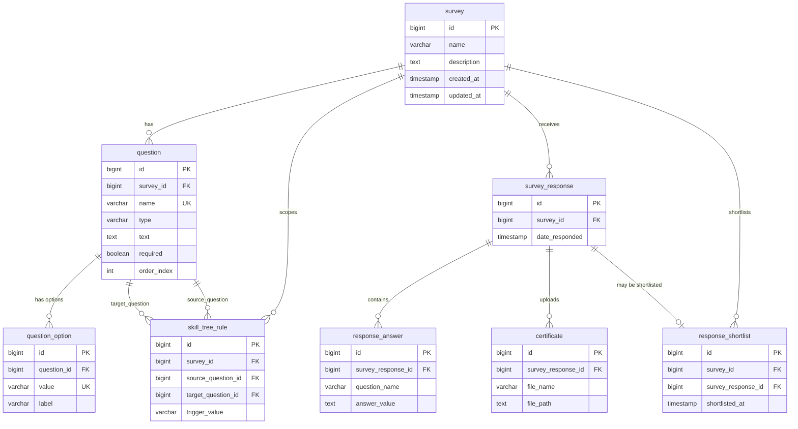

# SkyWorld Survey Platform — Detailed ERD

**Database:** `sky_survey_db`  
**RDBMS:** PostgreSQL 14+  
**Diagram source:** [`ERD.dbml`](ERD.dbml) → import at [dbdiagram.io](https://dbdiagram.io) → **Export → PNG**

---

## Entity relationship overview

---

## Table: `survey`

| Column | Type | Null | Key | Default | Description |
|--------|------|------|-----|---------|-------------|
| `id` | `BIGSERIAL` | NO | **PK** | auto | Surrogate primary key |
| `name` | `VARCHAR(255)` | NO | | | Survey title |
| `description` | `TEXT` | YES | | | Long description |
| `created_at` | `TIMESTAMP` | NO | | `CURRENT_TIMESTAMP` | Creation time |
| `updated_at` | `TIMESTAMP` | NO | | `CURRENT_TIMESTAMP` | Last update time |

**Primary key:** `id`  
**Foreign keys:** none (root entity)  
**Unique constraints:** none  
**Referenced by:** `question.survey_id`, `survey_response.survey_id`, `skill_tree_rule.survey_id`, `response_shortlist.survey_id`

---

## Table: `question`

| Column | Type | Null | Key | Default | Description |
|--------|------|------|-----|---------|-------------|
| `id` | `BIGSERIAL` | NO | **PK** | auto | Surrogate primary key |
| `survey_id` | `BIGINT` | NO | **FK** → `survey.id` | | Parent survey |
| `name` | `VARCHAR(255)` | NO | **UK**† | | Stable slug (`full_name`, `email_address`, …) |
| `type` | `VARCHAR(50)` | NO | | | `SHORT_TEXT`, `LONG_TEXT`, `EMAIL`, `SINGLE_CHOICE`, `MULTIPLE_CHOICE`, `FILE_UPLOAD`, `NUMBER` |
| `text` | `TEXT` | NO | | | Prompt shown to user (quoted as `"text"` in ERD.dbml because `text` is a DBML type keyword) |
| `description` | `TEXT` | YES | | | Helper / hint text |
| `required` | `BOOLEAN` | NO | | `FALSE` | Must answer before proceed |
| `order_index` | `INTEGER` | YES | | | Sort order in survey |
| `file_format` | `VARCHAR(64)` | YES | | | e.g. `.pdf` (file questions) |
| `max_file_size_mb` | `INTEGER` | YES | | | Upload size cap (MB) |
| `multiple_files` | `BOOLEAN` | YES | | | Allow multiple uploads |
| `min_number` | `INTEGER` | YES | | | Min value (number questions) |
| `max_number` | `INTEGER` | YES | | | Max value (number questions) |
| `branch_only` | `BOOLEAN` | NO | | `FALSE` | Hidden until branching rule fires |

† **Unique:** `uk_question_survey_name` on (`survey_id`, `name`)

**Primary key:** `id`  
**Foreign keys:**

| Constraint | Column | References | On delete |
|------------|--------|------------|-----------|
| `fk_question_survey` | `survey_id` | `survey(id)` | **CASCADE** |

**Indexes:** `idx_question_survey_order` (`survey_id`, `order_index`)  
**Referenced by:** `question_option.question_id`, `skill_tree_rule.source_question_id`, `skill_tree_rule.target_question_id`

---

## Table: `question_option`

| Column | Type | Null | Key | Default | Description |
|--------|------|------|-----|---------|-------------|
| `id` | `BIGSERIAL` | NO | **PK** | auto | Surrogate primary key |
| `question_id` | `BIGINT` | NO | **FK** → `question.id` | | Parent choice question |
| `value` | `VARCHAR(255)` | NO | **UK**† | | API wire value (`REACT`, `MALE`, …) |
| `label` | `VARCHAR(255)` | NO | | | Display label |
| `order_index` | `INTEGER` | YES | | | Option sort order |

† **Unique:** `uk_question_option_question_value` on (`question_id`, `value`)

**Primary key:** `id`  
**Foreign keys:**

| Constraint | Column | References | On delete |
|------------|--------|------------|-----------|
| `fk_question_option_question` | `question_id` | `question(id)` | **CASCADE** |

**Indexes:** `idx_question_option_question_order` (`question_id`, `order_index`)

---

## Table: `skill_tree_rule`

| Column | Type | Null | Key | Default | Description |
|--------|------|------|-----|---------|-------------|
| `id` | `BIGSERIAL` | NO | **PK** | auto | Surrogate primary key |
| `survey_id` | `BIGINT` | NO | **FK** → `survey.id` | | Owning survey |
| `source_question_id` | `BIGINT` | NO | **FK** → `question.id` | | Question whose answer is evaluated |
| `target_question_id` | `BIGINT` | NO | **FK** → `question.id` | | Question revealed on match |
| `trigger_value` | `VARCHAR(255)` | NO | | | Exact answer value to match |

**Primary key:** `id`  
**Foreign keys:**

| Constraint | Column | References | On delete |
|------------|--------|------------|-----------|
| `fk_skill_tree_survey` | `survey_id` | `survey(id)` | **CASCADE** |
| `fk_skill_tree_source` | `source_question_id` | `question(id)` | **CASCADE** |
| `fk_skill_tree_target` | `target_question_id` | `question(id)` | **CASCADE** |

**Indexes:** `idx_skill_tree_survey`, `idx_skill_tree_source` (`source_question_id`, `trigger_value`)

---

## Table: `survey_response`

| Column | Type | Null | Key | Default | Description |
|--------|------|------|-----|---------|-------------|
| `id` | `BIGSERIAL` | NO | **PK** | auto | Surrogate primary key |
| `survey_id` | `BIGINT` | NO | **FK** → `survey.id` | | Survey being answered |
| `date_responded` | `TIMESTAMP` | NO | | `CURRENT_TIMESTAMP` | Submission timestamp |

**Primary key:** `id`  
**Foreign keys:**

| Constraint | Column | References | On delete |
|------------|--------|------------|-----------|
| `fk_survey_response_survey` | `survey_id` | `survey(id)` | **CASCADE** |

**Indexes:** `idx_survey_response_survey_date` (`survey_id`, `date_responded DESC`)  
**Referenced by:** `response_answer`, `certificate`, `response_shortlist`

---

## Table: `response_answer`

| Column | Type | Null | Key | Default | Description |
|--------|------|------|-----|---------|-------------|
| `id` | `BIGSERIAL` | NO | **PK** | auto | Surrogate primary key |
| `survey_response_id` | `BIGINT` | NO | **FK** → `survey_response.id` | | Parent submission |
| `question_name` | `VARCHAR(255)` | NO | | | Matches `question.name` |
| `answer_value` | `TEXT` | YES | | | Answer text; multi-select uses `\|` delimiter |

**Primary key:** `id`  
**Foreign keys:**

| Constraint | Column | References | On delete |
|------------|--------|------------|-----------|
| `fk_response_answer_response` | `survey_response_id` | `survey_response(id)` | **CASCADE** |

**Indexes:** `idx_response_answer_name_value` (`question_name`, `answer_value`) — powers **email search** (`question_name = 'email_address'`)

---

## Table: `certificate`

| Column | Type | Null | Key | Default | Description |
|--------|------|------|-----|---------|-------------|
| `id` | `BIGSERIAL` | NO | **PK** | auto | Surrogate primary key |
| `survey_response_id` | `BIGINT` | NO | **FK** → `survey_response.id` | | Parent submission |
| `file_name` | `VARCHAR(255)` | NO | | | Original PDF filename |
| `file_path` | `TEXT` | NO | | | Server storage path |
| `uploaded_at` | `TIMESTAMP` | NO | | `CURRENT_TIMESTAMP` | Upload time |

**Primary key:** `id`  
**Foreign keys:**

| Constraint | Column | References | On delete |
|------------|--------|------------|-----------|
| `fk_certificate_response` | `survey_response_id` | `survey_response(id)` | **CASCADE** |

**Indexes:** `idx_certificate_response` (`survey_response_id`)

---

## Table: `response_shortlist`

| Column | Type | Null | Key | Default | Description |
|--------|------|------|-----|---------|-------------|
| `id` | `BIGSERIAL` | NO | **PK** | auto | Surrogate primary key |
| `survey_id` | `BIGINT` | NO | **FK** → `survey.id` | | Survey context |
| `survey_response_id` | `BIGINT` | NO | **FK** → `survey_response.id` | | Shortlisted response |
| `shortlisted_at` | `TIMESTAMP` | NO | | `CURRENT_TIMESTAMP` | When flagged |

**Primary key:** `id`  
**Foreign keys:**

| Constraint | Column | References | On delete |
|------------|--------|------------|-----------|
| `fk_shortlist_survey` | `survey_id` | `survey(id)` | **CASCADE** |
| `fk_shortlist_response` | `survey_response_id` | `survey_response(id)` | **CASCADE** |

**Unique:** `uk_shortlist_survey_response` (`survey_id`, `survey_response_id`)  
**Indexes:** `idx_shortlist_survey_date` (`survey_id`, `shortlisted_at DESC`)

---

## Cardinality summary

| Parent | Child | Relationship | FK column(s) | Delete rule |
|--------|-------|--------------|--------------|-------------|
| `survey` | `question` | 1 : N | `question.survey_id` | CASCADE |
| `survey` | `survey_response` | 1 : N | `survey_response.survey_id` | CASCADE |
| `survey` | `skill_tree_rule` | 1 : N | `skill_tree_rule.survey_id` | CASCADE |
| `survey` | `response_shortlist` | 1 : N | `response_shortlist.survey_id` | CASCADE |
| `question` | `question_option` | 1 : N | `question_option.question_id` | CASCADE |
| `question` | `skill_tree_rule` (source) | 1 : N | `skill_tree_rule.source_question_id` | CASCADE |
| `question` | `skill_tree_rule` (target) | 1 : N | `skill_tree_rule.target_question_id` | CASCADE |
| `survey_response` | `response_answer` | 1 : N | `response_answer.survey_response_id` | CASCADE |
| `survey_response` | `certificate` | 1 : N | `certificate.survey_response_id` | CASCADE |
| `survey_response` | `response_shortlist` | 1 : 0..1 | `response_shortlist.survey_response_id` | CASCADE |

---

## Export PNG from dbdiagram.io

1. Open [https://dbdiagram.io/d](https://dbdiagram.io/d)
2. **Import** → paste contents of [`ERD.dbml`](ERD.dbml)
3. Arrange layout if needed (auto-layout available)
4. **Export** → **PNG** (or PDF for submission)
5. Save as `database/ERD.png` for the API repository deliverable

---

## Logical data flow

1. **Admin** creates a `survey` and attaches `question` rows (+ `question_option` for choices).
2. Optional `skill_tree_rule` rows define conditional visibility (`branch_only` targets).
3. **Respondent** submits → new `survey_response` + `response_answer` rows (+ `certificate` files for uploads).
4. **Admin** lists responses filtered by `response_answer` where `question_name = 'email_address'`.
5. **Admin** may add `response_shortlist` to mark candidates of interest.
